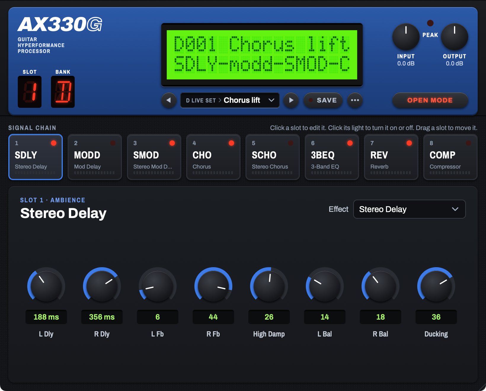

# 3. Use the plugin

## 3.1 The signal path

The plugin sends the audio through these stages, in this order:

1. The host input, stereo or mono.
2. A fixed level change of −8.5 dB. This stage sets the level reference (see 3.3).
3. A sample rate converter from the host rate to 39,062.5 Hz. This is the internal rate of the unit. This manual calls it the device rate.
4. The input stage, with the **Input** control. This stage is a model of the analog input circuit and the analog-to-digital converter of the unit.
5. Slots 1 to 8, in that order. A slot has an effect only when it holds a block and its light is on.
6. A sample rate converter from the device rate back to the host rate.
7. The converter chain. This stage is a model of the frequency response of the converters and analog circuits of the unit.
8. The **Output** control.
9. The host output, stereo.

## 3.2 The editor

The editor has these parts, from top to bottom:

1. **The face.** A blue plate, like the unit's own. It holds the AX330G logo, the **Input** and **Output** knobs, the **Peak** LED, and the LCD. It also holds a red digit that shows the selected slot, and the **Mode** keys.
2. **Signal chain.** Eight tiles, one for each slot. Click a tile to edit that slot in the panel below it.
3. **The editing panel.** The controls for the slot you selected.
4. **Size.** The whole editor scales as one piece. See "Change the size" below.

The editor uses the Archivo and Archivo Narrow typefaces. These fonts come with the plugin's source code, under the SIL Open Font License.

### Use a knob

A knob shows its value in a box below it. The box also shows the unit of the value, for example "ms", "Hz", "s" or "dB".

To change a value, do one of these steps:

- Drag the knob up to increase the value, or down to decrease it.
- Hold the Shift key or the Command key while you drag, for finer steps.
- Turn the mouse wheel over the knob.
- Push an arrow key, when the knob has keyboard focus.
- Double-click the value box, type a value, and push the Return key.

Double-click a knob to reset it to the default value of its block.

The knob moves only in the steps of its parameter. For example, a 0 to 50 parameter moves in steps of 1.

Some knobs have no number at all. Mid Freq, Reverb Type and Stereo Chorus Mode are each a list of named items. The box below the knob shows the name of the current item, for example "HALL". Turn the knob to step to the next or the previous item.

### Change the size

The editor scales as one piece, face and panel together.

Do one of these steps to change the size:

- Drag the lower-right corner of the window. The editor keeps its shape.
- Right-click an empty area of the editor. Choose a size from the menu.

The size menu offers 75, 100, 125, 150 and 200 %. The default size is 820 by 660 points. The size range is 70 % to 200 %.

The plugin saves the size and the selected slot with the host project.

The right-click menu also shows the plugin's version and build number.

## 3.3 Input and Output

| Control | Range | Default | Unit |
|---|---|---|---|
| **Input** | −24 to +24 | 0 | dB |
| **Output** | −24 to +24 | 0 | dB |

### The level reference

The plugin uses this reference: 0 dBFS in the host is equal to +18 dBu at the input jack of the unit.

The **Input** control is a model of the Input Level knob of the unit. It has two calibrated points:

| Input | Equivalent position of the unit's Input Level knob |
|---|---|
| 0 dB | LIN, the reference position. All captures of the effect blocks use this position. |
| +14 dB | MAX, the knob at its fully clockwise position |

The measured difference between LIN and MAX is 14.05 dB. There are no captures at positions between LIN and MAX. Thus, the plugin shows the Input control in dB and not in the numbers of the unit's knob.

Values above +14 dB have no equivalent on the unit. They drive the emulated converter harder than the unit can.

### What Input does

The Input control is a real gain, as on the unit. When you increase Input, the plugin becomes louder, and it also goes into overload sooner.

The input stage has these parts, in this order:

1. The Input gain.
2. A pre-emphasis filter. This first-order shelf filter increases the treble. It adds +0.6 dB at 1 kHz and about +8.8 dB at 10 kHz, relative to low frequencies.
3. A hard clip at the full scale of the converter.
4. An 18-bit quantizer, the same word length as the unit's converter.
5. A de-emphasis filter. This filter is the exact inverse of the pre-emphasis filter.

Below the clip level, the pre-emphasis and the de-emphasis cancel, and the input stage has a flat frequency response. Above the clip level, the treble clips first, because the pre-emphasis made it louder. This is the overload behavior of the unit.

### What Output does

The Output control is a digital gain after the converter chain. It does not change the sound of any block.

Set Input and Output to 0 dB, and turn all slots off. A 1 kHz signal then comes out at the same level as it went in. The output level of the unit itself is 7 dB lower than its input at LIN. The plugin does not copy this level loss.

CAUTION: The output of the plugin can go above 0 dBFS. With Input at maximum, the output peak can be +10.4 dBFS. Make sure that the next stage in the host can accept this level.

WARNING: A high Input value with a high Output value can make a very loud output. Decrease the monitor level before you increase Input or Output.

## 3.4 The Peak LED

The **Peak** LED is a model of the Peak LED of the unit. On the unit, the converter's overload flag drives this LED.

The LED comes on when the signal after the pre-emphasis filter reaches a level 1 dB below the full scale of the converter. The LED stays on for 300 ms after the last peak at or above this level.

The pre-emphasis filter makes treble louder at the clip point. Thus, a high-frequency signal turns the LED on at a lower host level than a low-frequency signal.

The table gives the host level at which a sine wave turns on the LED. The values come from the input stage model.

| Sine frequency | Input 0 dB (LIN) | Input +14 dB (MAX) |
|---|---|---|
| 100 Hz | about +9.5 dBFS | about −4.5 dBFS |
| 1 kHz | about +9.0 dBFS | about −5.0 dBFS |
| 3 kHz | about +6.2 dBFS | about −7.8 dBFS |
| 5 kHz | about +3.8 dBFS | about −10.2 dBFS |
| 10 kHz | about +0.8 dBFS | about −13.2 dBFS |
| 15 kHz | about −0.2 dBFS | about −14.2 dBFS |

The hard clip starts about 1 dB above the level that turns on the LED. Thus, the LED comes on before the clip.

NOTE: At Input 0 dB, a signal below about 0 dBFS in the host does not turn on the LED. This is correct. At LIN, the unit also has much headroom.

NOTE: The LED shows the level at the input stage only. It shows this level for all slots, also when all slots are off.

## 3.5 Mode

The **Mode** keys are two buttons on the face: **OPEN** and **AS THE UNIT**. A lit dot shows the current mode.

| Key | Function |
|---|---|
| Open | Each slot can hold any block, in any order. |
| As the unit | Reserved for a future version. |

In version 0.9.1, the Mode keys have no effect on the sound. Both keys give the Open behavior.

A future version will use "As the unit" to apply the chain rules of the unit. For example, the unit puts the 3-Band EQ last in Block 1, and it has no Stereo Chorus.

## 3.6 The slots

### The signal chain

Each of the eight tiles in the signal chain shows:

- The slot number.
- The block's short name, for example "REV". An empty slot shows a dash.
- The block's full name, for example "Reverb".
- A red light. The light is on when the block is on.

Click a tile to edit that slot in the editing panel. Click a tile's light to turn the block on or off. Drag a tile to move its block to a different slot. See "Move a block" below.

### Move a block

You can change the order of the blocks in the chain. The plugin moves a block with all of its settings.

To move a block with the mouse:

1. Put the pointer on the tile of the block. Do not put it on the light.
2. Push and hold the mouse button.
3. Drag the tile to the left or to the right.
4. Release the mouse button when the dashed outline is at the new slot.

While you drag, the other tiles move to show the new order. The dashed outline shows the slot that the block goes to.

To cancel the move, push the Escape key before you release the mouse button. You can also drag the tile far above or below the row, and then release it.

To move a block with the keyboard, push the Tab key until the tile has focus. Then hold the Option key and push the Left Arrow or the Right Arrow. The block moves by one slot.

A move inserts the block. It does not exchange two blocks. For example, move the block in slot 2 to slot 5. The blocks in slots 3, 4 and 5 then go to slots 2, 3 and 4.

These items move with the block:

- The block type.
- The on or off state.
- All the parameter values.

Empty slots move in the same way as blocks.

The slot numbers stay in their positions. After the move, the editor selects the block at its new slot.

A move can reset the sound in the delay lines of the blocks that move. The echoes and the reverb tail that are playing can stop.

CAUTION: Host automation stays with the slot number, not with the block. For example, automation for "2: L Dly" always controls slot 2. After you move a block from slot 2, this automation controls the block that is now in slot 2. Move the automation lanes in the host if necessary.

NOTE: The host records a move as changes to many parameters. The host undo function cannot undo a move in one step.

### The editing panel

The editing panel shows the controls for the slot you selected:

- The slot number and its group, for example "SLOT 5 · AMBIENCE".
- The block's full name.
- The **Effect** menu. Choose the block for this slot, or choose "Off" to empty it.
- The **Stereo In** switch, on the blocks that have one. See "Stereo In" below.
- One knob for each parameter of the block, in the unit's own order.

An empty slot shows "Choose an effect for this slot."

The group names come from the unit's own layout:

| Group | Blocks |
|---|---|
| BLOCK 1 | Compressor, 3-Band EQ |
| MOD1 | Chorus |
| MOD1 · WHAT IF | Stereo Chorus |
| MOD2 | Mod Delay, Stereo Mod Delay |
| AMBIENCE | Stereo Delay, Reverb |
| EMPTY | No block chosen |

The Effect menu has these items:

| Effect | LCD abbreviation | Chapter |
|---|---|---|
| Off | — | — |
| Stereo Delay | SDLY | [Stereo Delay](04-blocks/stereo-delay.md) |
| Mod Delay | MODD | [Mod Delay](04-blocks/mod-delay.md) |
| Stereo Mod Delay | SMOD | [Stereo Mod Delay](04-blocks/stereo-mod-delay.md) |
| Chorus | CHO | [Chorus](04-blocks/chorus.md) |
| Stereo Chorus | SCHO | [Stereo Chorus](04-blocks/stereo-chorus.md) |
| 3-Band EQ | 3BEQ | [3-Band EQ](04-blocks/3-band-eq.md) |
| Reverb | REV | [Reverb](04-blocks/reverb.md) |
| Compressor | COMP | [Compressor](04-blocks/compressor.md) |

### Rules for the slots

- The plugin processes the slots in order, from slot 1 to slot 8.
- A slot that is off, or empty, passes the signal without change.
- You can put the same block in more than one slot.
- When you change the Effect of a slot, its parameters go to the default values of the new block.
- When you open a saved project, the slots keep their saved values.
- When you move a block, it keeps its values. See "Move a block" above.

### Mono and stereo blocks

The unit has one guitar input, so most of its blocks process one mono signal throughout. Three blocks are different: the unit routes each channel of these three on its own path, at least for the dry signal. The owner's manual draws five such routings, lettered ⓐ to ⓔ. The table below gives the routing of each block that can carry a stereo signal.

| Block | Input | Output | Routing |
|---|---|---|---|
| Stereo Delay | Stereo: each channel keeps its own signal | Stereo: each channel independent | ⓔ, two independent effects |
| Mod Delay | Wet: mono sum. Dry: each channel keeps its own signal | Stereo, from two balance controls | ⓒ, one effect, two dry paths |
| Stereo Mod Delay | Stereo: each channel keeps its own signal | Stereo | ⓔ, two independent effects |
| Chorus | Mono sum | Mono, the same signal on both channels | mono throughout |
| Stereo Chorus | Mono sum | Stereo | not on the unit |
| 3-Band EQ | Mono sum | Mono, the same signal on both channels | mono throughout |
| Reverb | Wet: mono sum. Dry: each channel keeps its own signal | Stereo | ⓒ, one effect, two dry paths |
| Compressor | Mono sum | Mono, the same signal on both channels | mono throughout |

NOTE: A block with a mono sum at its input removes the stereo image of the slots before it. For example, a Chorus after a Stereo Delay makes the stereo delay mono. Put the stereo blocks after the mono blocks to keep the stereo image.

NOTE: Version 0.8.6 fixed the routing of the Mod Delay, the Reverb and the Stereo Mod Delay to match the table above. Claude checked the fix: outputs stay bit-identical with a mono source. See [chapter 6](06-limitations.md#64-the-delay-blocks).

### Stereo In

Six blocks have a mono input in Mono mode: 3-Band EQ, Chorus, Stereo Chorus, Mod Delay, Reverb and Compressor. Each one has a **Stereo In** switch in its editing panel, next to the Effect menu.

**Stereo In** has two positions: Mono and Stereo. Mono is the default, and it matches the unit.

In Mono, the block mixes the left and right inputs to one signal, as the unit does. In Stereo, each channel keeps its own path through the block. Each block's chapter in [chapter 4](04-blocks/README.md) gives its exact Stereo behavior.

With a mono source, Stereo and Mono give the same output. Claude checked this: the two settings are bit-identical. With a left-only input in Stereo, the right output is exactly silent. With different left and right inputs, Stereo keeps the two channels separate, at a correlation of 0.00, against 1.00 in Mono.

**Stereo In** is a "what if" addition. The unit never had it.

Put a stereo block early in the chain to keep a wide sound through later blocks. For example, put the Stereo Chorus in Stereo before a Reverb in Stereo.

NOTE: Stereo In fits the spirit of the "Open" mode only. The Mode keys do not enforce this yet.

### Host automation

The host shows a fixed list of parameters for each slot. The list contains the parameters of all block types, because the host cannot change the list while it runs. Only the parameters of the block in the slot have an effect.

The host names each parameter with the slot number, for example "3: Speed" or "3: High Damp". Blocks that use the same parameter name share one host parameter in a slot. The Type parameter of the Reverb has the host name "Reverb Type". This name keeps it different from the Effect menu of the slot.

## 3.7 The LCD

The LCD is a model of the 16-character, 2-line display of the unit. It uses the character font of the unit's display controller.

### The start-up sequence

The start-up sequence plays when the editor opens for the first time in a plugin instance. It is a copy of the sequence that the unit shows when you connect its power. Mark O'Brien recorded a video of his AX300G at power-on. Claude measured the sequence dot by dot from that video.

| Time from start | Display |
|---|---|
| 0 s | Display off |
| 0.40 s | Backlight on |
| 0.48 s | "TONEWORKS" and "GUITAR" |
| 1.37 s | Line 2 changes to "HYPERFORMANCE" |
| 2.29 s | Line 2 changes to "PROCESSOR" |
| 3.21 s | Line 2 changes to "AX330G" |
| 4.13 s | Large letters "AX330G" move across the display in seven steps, 154.8 ms each |
| 5.21 s | Display clear |
| 5.25 s | The play page |

The sequence does not play again when you close the editor and open it again.

To play the sequence again, double-click the LCD.

### The play page

The play page has two lines:

- Line 1 shows "--- INIT". This line is a placeholder. A future version with programs will show the program number and name here, as the unit does.
- Line 2 shows the chain line.

The chain line shows one 4-character abbreviation for each slot that holds a block, in slot order. A hyphen separates the abbreviations. An empty slot does not show. If all slots are empty, the line shows "(EMPTY CHAIN)".

The case of the letters shows the state of each block, as on the unit:

- UPPERCASE letters: the block is on.
- lowercase letters: the block is off.

Example: `COMP-3beq-CHO -REV ` shows four blocks. The 3-Band EQ is off, and the other three blocks are on. A short abbreviation gets spaces at its end to make four characters.

The LCD shows 16 characters at a time. If the chain line is longer than 16 characters, turn the mouse wheel over the LCD. Each step of the wheel moves the line by one character. The dial of the unit moves the line in the same way.

## 3.8 Sample rates and latency

The plugin operates at any host sample rate. The effect blocks always operate at the device rate of 39,062.5 Hz, as on the unit. The plugin converts the sample rate at the input and at the output.

The sample rate converters are flat to 19 kHz. The converter chain then limits the high frequencies as the unit does:

| Frequency | Level relative to 1 kHz |
|---|---|
| 18 kHz | −0.1 dB |
| 19 kHz | −1.1 dB |
| 19.5 kHz | −10.3 dB |
| 20 kHz | −14.4 dB |

The plugin tells the host its latency. The host uses this value to align the plugin output with the other tracks. The latency has three parts. These are the delay of the two sample rate converters, the unit's own 0.27 ms latency, and the delay of the converter chain filter. At a host rate of 48 kHz, the reported latency was 355 samples (7.4 ms) in a measurement.

The plugin tells the host that its tail is 10 s long. The tail is the time that the plugin can continue to give output after the input stops.

## 3.9 Save your work

The plugin saves all parameter values in the host project. The host saves them when you save the project.

The plugin has no program library in this version. Use the preset function of the host to save and load complete plugin states.
